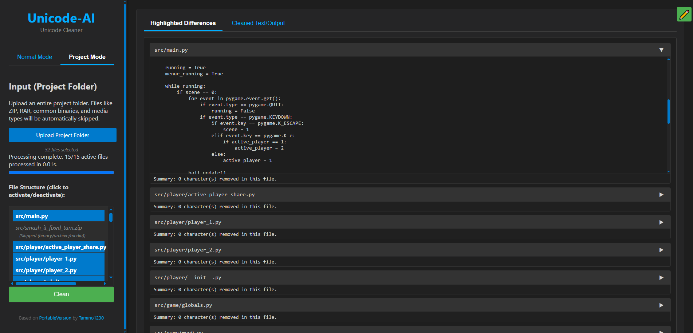

# Unicode-AI

Unicode-AI is a modern, privacy-friendly Unicode cleaner for text and code files. It helps you remove invisible, zero-width, and other problematic Unicode characters that can cause issues in code, documents, and projects. The app is fully client-side and works in your browser - no data is sent anywhere.

It should remove varius Invisible Unicode Characters in Code, Texts, etc.

**Author:** [Tamino1230](https://github.com/Tamino1230)

## Features

- **Remove Problematic Unicode Characters:** Cleans zero-width, formatting, and other hidden Unicode characters from pasted text, uploaded files, or entire project folders.
- **Customizable Character List:** Edit which Unicode characters or ranges are removed using a convenient sidebar.
- **Project Mode:** Upload a whole folder (recursively) and clean all text/code files at once. Skips binaries, archives, and media files automatically.
- **Difference Highlighting:** See exactly which characters were removed with a visual diff.
- **Statistics:** Get a summary of which characters were found and removed.
- **Download Cleaned Files:** Download a cleaned file or a ZIP of your cleaned project, including an analysis report.
- **Portable:** No installation required. Just open [tamino1230.github.io/Unicode-Ai](https://tamino1230.github.io/Unicode-Ai) in your browser.

## Usage

1. **Open [tamino1230.github.io/Unicode-Ai](https://tamino1230.github.io/Unicode-Ai) in your browser.**
2. Choose **Normal Mode** (for single files or pasted text) or **Project Mode** (for folders).
3. Paste text, upload a file, or select a folder.
4. Click **Clean**.
5. View the highlighted differences, cleaned output, and statistics.
6. Download your cleaned file or project.
7. Use the ✏️ button (top right) to edit which Unicode characters are removed. You can reset to default at any time.

## Screenshots

## Credits

- **Author:** [Tamino1230](https://github.com/Tamino1230)
- **GitHub Repo:** [github.com/tamino1230/unicode-ai](https://github.com/tamino1230/unicode-ai)
- **Portable EXE:** For a Windows portable executable version, see [unicode-ai-portable-version](https://github.com/tamino1230/unicode-ai-portable-version)

## License

MIT License. See [LICENSE](LICENSE).

---

#* This project is open source and privacy-friendly. All processing happens locally in your browser. No data is sent to any server.
